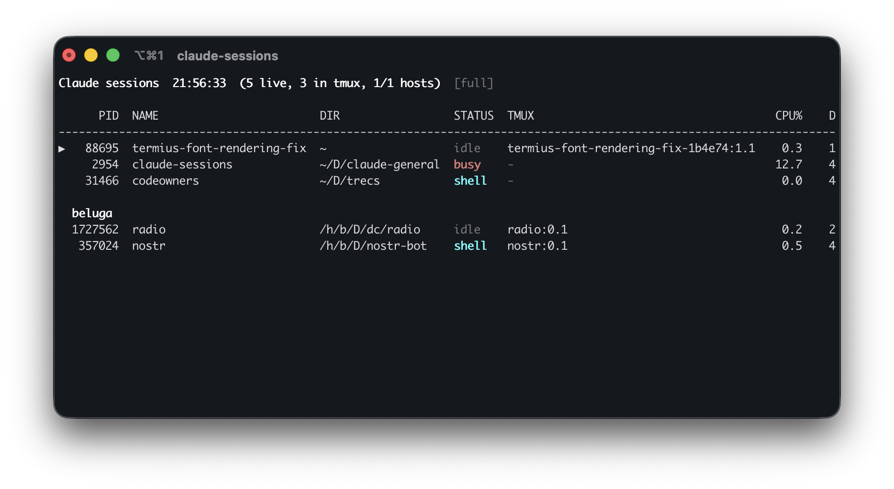

# claude-sessions

A live, multi-host viewer and manager for running [Claude Code](https://claude.com/claude-code) CLI sessions.

Single static binary, no runtime deps. Lists every Claude session on your machine, attaches to or migrates them into tmux, runs an HTTP server so other hosts can include you in their view, and renders everything in a tight live TUI.




## Install

### One-liner (auto-detect OS/arch, SHA256-verified)

```sh
curl -fsSL https://raw.githubusercontent.com/rainder/claude-sessions/main/install.sh | bash
```

Installs to `~/.local/bin/claude-sessions`. Override with env vars:

```sh
curl -fsSL https://raw.githubusercontent.com/rainder/claude-sessions/main/install.sh | VERSION=v1.0.0 bash
curl -fsSL https://raw.githubusercontent.com/rainder/claude-sessions/main/install.sh | INSTALL_DIR=/usr/local/bin bash
```

Supported: `darwin/arm64`, `linux/amd64`, `linux/arm64`.

### Manual download

Pick the matching binary from [the releases page](https://github.com/rainder/claude-sessions/releases/latest)
and drop it on your `$PATH`. Each release ships a `SHA256SUMS` file you can verify against.

### From source

```sh
go install github.com/rainder/claude-sessions@latest
# or, from a clone:
make build          # cross-compiles all archs into ./bin
make install        # copies the current-host binary to ~/.local/bin
```

`make build` always produces all three target binaries in `./bin/`:

```
bin/claude-sessions-darwin-arm64
bin/claude-sessions-linux-amd64
bin/claude-sessions-linux-arm64
```

For remote deploys (macOS dev box → Linux server / Pi):

```sh
make deploy-linux-amd64 HOST=user@server       # any Linux x86_64 box
make deploy-linux-arm64 HOST=pi@raspberrypi    # any Linux arm64 box
```

`HOST` is passed straight to `ssh`/`scp`, so anything `~/.ssh/config` resolves
works (e.g. `HOST=myserver` if you have a `Host myserver` block). The binary
lands at `~/.local/bin/claude-sessions` on the remote.

If you deploy to the same hosts often, drop a `Makefile.local` (gitignored)
beside the Makefile with shortcuts:

```makefile
deploy-myserver:
	$(MAKE) deploy-linux-amd64 HOST=myserver

deploy-raspi:
	$(MAKE) deploy-linux-arm64 HOST=pi@raspi
```

Then `make deploy-myserver` / `make deploy-raspi` work the same.

## Usage

```sh
claude-sessions                            # live TUI (default)
claude-sessions --once                     # one-shot print
claude-sessions -s                         # run HTTP server (defaults to 127.0.0.1:8765)
claude-sessions -s --bind tailscale        # bind to this host's Tailscale IPv4
claude-sessions -s --bind 0.0.0.0 --port 9000   # any address / port

claude-sessions kill PID [-y]              # kill a session (tmux-aware)
claude-sessions migrate PID [-y]           # kill + resume in a new tmux session
claude-sessions new --cwd PATH [--name N]  # spawn a tmux+claude session
claude-sessions attach PID                 # tmux attach (or switch-client)
claude-sessions preview PID                # tmux capture or transcript tail
claude-sessions tmux-info PID              # tmux session name for a pid
```

### Live-view keys

| Key     | Action                                          |
| ------- | ----------------------------------------------- |
| ↑/↓     | navigate                                        |
| n       | new tmux session (↑/↓ cwd · ←/→ command)        |
| k       | kill (tmux-aware)                               |
| a       | attach (or migrate to tmux first)               |
| Enter/p | open fullscreen inspector                       |
| m       | toggle view mode (full ↔ minimal, persisted)    |
| r       | refresh now                                     |
| ?       | help modal                                      |
| q       | quit (Ctrl-C / Ctrl-D also work)                |
| click   | select a row (double-click opens the inspector) |
| wheel   | scroll the list                                 |

### Fullscreen inspector

`Enter`/`p` opens a fullscreen inspector for the selected row: a live tmux
pane snapshot, falling back to the transcript tail when the session has no
pane.

| Key       | Action                               |
| --------- | ------------------------------------- |
| ↑/↓, j/k  | scroll one line                      |
| PgUp/PgDn | scroll one page                      |
| Home/End  | jump to oldest / resume live follow  |
| r         | refresh now                          |
| Esc/q/p   | back to the list                     |

Mouse works throughout: wheel scrolls, and the footer's Back/Refresh/Follow
controls are clickable.

### Command presets

Add a `commands:` block to `~/.config/claude-sessions/servers.yaml` to offer a
choice of launch commands from the `n` (new session) modal:

```yaml
commands:
  - name: Claude
    command: claude
  - name: ClaudeX
    command: claudex
  - name: Fable
    command: claude --model fable
```

- If `commands:` is absent (or empty/invalid), it defaults to a single preset,
  `Claude` running `claude`.
- In the `n` modal, left/right cycles command presets without moving the CWD
  selection; up/down cycles CWD suggestions without changing the command.
- The last confirmed preset is remembered (`~/.config/claude-sessions/command-preset`)
  and is preselected the next time the modal opens; canceling the modal does
  not change the remembered preset.
- Remote hosts resolve presets from their *own* `servers.yaml` — give a remote
  host's config matching preset names if you want the same picker options
  there. The command text for a given preset name may legitimately differ per
  host (e.g. a different binary path).
- Remote CWD suggestions load on demand over the HTTP API when a remote host
  is selected in the modal; if they don't arrive in time, the modal falls back
  to a note plus a manual path-entry row instead of blocking.
- Command strings are trusted shell input — anything in `command:` runs
  as-is inside the spawned tmux pane. Don't wire this to input you don't
  control.

### Multi-host

Add servers to `~/.config/claude-sessions/servers.yaml`:

```yaml
servers:
  - name: myserver
    host: 100.64.0.1            # Tailscale IPv4 of the server
    port: 8765
    token: <copy from server>
    ssh_host: myserver          # optional, defaults to host
    ssh_user: alice             # optional, defaults to your local $USER
                                # tmux sessions are per-user — set this if the
                                # server runs as a different user than you log
                                # in as locally, or `ssh attach` shows "no sessions"
  - name: raspi
    host: 100.64.0.2
    port: 8765
    token: <copy from server>
    ssh_user: pi
  - name: legacy
    host: 100.64.0.3
    port: 8765
    token: <copy from server>
    enable: false               # optional, defaults to true; false hides this entry
```

Start the server on each remote host with `claude-sessions -s`. The bind IP and token are printed; copy them into the client's `servers.yaml`. Token is auto-generated on first start and persisted at `~/.config/claude-sessions/server-token` (mode 0600).

Remote rows appear in their own section under the local one. Selection works across all rows; actions on a remote row use the HTTP API + `ssh -t <ssh_host>` for attach.

## Files

- `~/.claude/sessions/<pid>.json` — session metadata (written by Claude Code)
- `~/.claude/projects/<encoded-cwd>/<sid>.jsonl` — conversation transcripts
- `~/.config/claude-sessions/view-mode` — persisted view mode (1 or 2)
- `~/.config/claude-sessions/server-token` — bearer token (server side, 0600)
- `~/.config/claude-sessions/servers.yaml` — client server list + `commands:` presets
- `~/.config/claude-sessions/command-preset` — remembered command preset name

## License

MIT — see [LICENSE](LICENSE).

## Layout

```
main.go              CLI dispatch
session.go           Session struct + CollectLocal
tmux.go              pane mapping + ppid walk
render.go            full/minimal views with multi-section layout
config.go            view-mode load/save
yaml.go              tiny YAML parser for servers.yaml
remote.go            HTTP client + RemoteResult
server.go            HTTP server (Tailscale bind, bearer auth, all endpoints)
tui.go               alt-screen + raw mode + key reader + main loop
usage.go             account rate-limit polling (5h/weekly bars in header)
actions.go           local action handlers (kill/attach/preview/new)
remote_actions.go    remote action handlers
commands.go          scriptable subcommands (used by server shell-out)
migrate.go           shared migrate/spawn logic
preview.go           tmux capture / JSONL transcript renderer
picker.go            cwd suggestions for `new` (live + history)
new_picker.go        two-axis new-session modal (command preset x cwd)
helpers.go           terminal mode helpers, prompts
termios_*.go         platform ioctl constants (BSD vs Linux)
```
