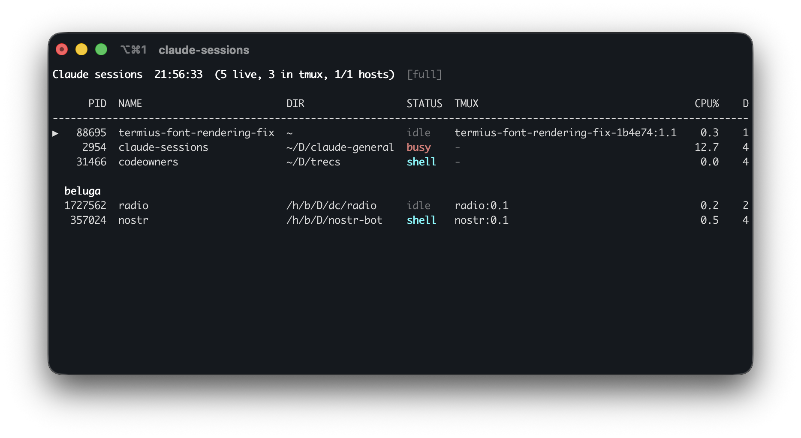

# claude-sessions

A live, multi-host viewer and manager for running [Claude Code](https://claude.com/claude-code) CLI sessions.

Single static binary, no runtime deps. Lists every Claude session on your machine, attaches to or migrates them into tmux, runs an HTTP server so other hosts can include you in their view, and renders everything in a tight live TUI.




## Install

### One-liner (auto-detect OS/arch, SHA256-verified)

```sh
curl -fsSL https://raw.githubusercontent.com/rainder/claude-sessions/main/install.sh | bash
```

Installs to `~/.local/bin/claude-sessions`. Override with env vars:

```sh
curl -fsSL https://raw.githubusercontent.com/rainder/claude-sessions/main/install.sh | VERSION=v1.0.0 bash
curl -fsSL https://raw.githubusercontent.com/rainder/claude-sessions/main/install.sh | INSTALL_DIR=/usr/local/bin bash
```

Supported: `darwin/arm64`, `linux/amd64`, `linux/arm64`.

### Manual download

Pick the matching binary from [the releases page](https://github.com/rainder/claude-sessions/releases/latest)
and drop it on your `$PATH`. Each release ships a `SHA256SUMS` file you can verify against.

### From source

```sh
go install github.com/rainder/claude-sessions@latest
# or, from a clone:
make build          # cross-compiles all archs into ./bin
make install        # copies the current-host binary to ~/.local/bin
```

`make build` always produces all three target binaries in `./bin/`:

```
bin/claude-sessions-darwin-arm64
bin/claude-sessions-linux-amd64
bin/claude-sessions-linux-arm64
```

For remote deploys (macOS dev box → Linux server / Pi):

```sh
make deploy-linux-amd64 HOST=user@server       # any Linux x86_64 box
make deploy-linux-arm64 HOST=pi@raspberrypi    # any Linux arm64 box
```

`HOST` is passed straight to `ssh`/`scp`, so anything `~/.ssh/config` resolves
works (e.g. `HOST=myserver` if you have a `Host myserver` block). The binary
lands at `~/.local/bin/claude-sessions` on the remote.

If you deploy to the same hosts often, drop a `Makefile.local` (gitignored)
beside the Makefile with shortcuts:

```makefile
deploy-myserver:
	$(MAKE) deploy-linux-amd64 HOST=myserver

deploy-raspi:
	$(MAKE) deploy-linux-arm64 HOST=pi@raspi
```

Then `make deploy-myserver` / `make deploy-raspi` work the same.

## Usage

```sh
claude-sessions                            # live TUI (default)
claude-sessions --once                     # one-shot print
claude-sessions -s                         # run HTTP server (defaults to 127.0.0.1:8765)
claude-sessions -s --bind tailscale        # bind to this host's Tailscale IPv4
claude-sessions -s --bind 0.0.0.0 --port 9000   # any address / port

claude-sessions kill PID [-y] [--remove-worktree]
                                            # kill a session (tmux-aware); offers to remove
                                            # a worktree left with no live sessions
claude-sessions migrate PID [-y]           # kill + resume in a new tmux session
claude-sessions new --dir PATH [--name N] [--command PRESET] [--server S] [PROMPT...]
                                            # spawn a tmux+claude session, locally or on a server
claude-sessions service install [--port N] [--bind ADDR] | uninstall | status
                                            # run the server supervised (launchd on macOS,
                                            # systemd --user on Linux); install also starts it
claude-sessions pair [--port N]            # print a pairing QR for the iOS app
claude-sessions notify-test                # send a test push to every registered device
claude-sessions attach PID                 # tmux attach (or switch-client)
claude-sessions preview PID                # tmux capture or transcript tail
claude-sessions tmux-info PID              # tmux session name for a pid
```

### Live-view keys

| Key     | Action                                          |
| ------- | ----------------------------------------------- |
| ↑/↓     | navigate                                        |
| n       | new tmux session (↑/↓ cwd · ←/→ command)        |
| k       | kill (tmux-aware)                               |
| a       | attach (or migrate to tmux first)               |
| Enter/p | open fullscreen inspector                       |
| m       | toggle view mode (full ↔ minimal, persisted)    |
| r       | refresh now                                     |
| ?       | help modal                                      |
| q       | quit (Ctrl-C / Ctrl-D also work)                |
| click   | select a row (double-click opens the inspector) |
| wheel   | scroll the list                                 |

### Fullscreen inspector

`Enter`/`p` opens a fullscreen inspector for the selected row: a live tmux
pane snapshot, falling back to the transcript tail when the session has no
pane.

| Key       | Action                               |
| --------- | ------------------------------------- |
| ↑/↓, j/k  | scroll one line                      |
| PgUp/PgDn | scroll one page                      |
| Home/End  | jump to oldest / resume live follow  |
| r         | refresh now                          |
| Esc/q/p   | back to the list                     |

Mouse works throughout: wheel scrolls, and the footer's Back/Refresh/Follow
controls are clickable.

### Command presets

Add a `commands:` block to `~/.config/claude-sessions/servers.yaml` to offer a
choice of launch commands from the `n` (new session) modal:

```yaml
commands:
  - name: Claude
    command: claude
  - name: ClaudeX
    command: claudex
  - name: Fable
    command: claude --model fable
```

- If `commands:` is absent (or empty/invalid), it defaults to a single preset,
  `Claude` running `claude`.
- In the `n` modal, left/right cycles command presets without moving the CWD
  selection; up/down cycles CWD suggestions without changing the command.
- The last confirmed preset is remembered (`~/.config/claude-sessions/command-preset`)
  and is preselected the next time the modal opens; canceling the modal does
  not change the remembered preset.
- Remote hosts resolve presets from their *own* `servers.yaml` — give a remote
  host's config matching preset names if you want the same picker options
  there. The command text for a given preset name may legitimately differ per
  host (e.g. a different binary path).
- The client fetches a remote host's preset *names* on demand (`GET
  /presets`, names only — command text never crosses the wire) to populate
  the `n` modal's choices and to validate `claude-sessions new --server S
  --command NAME` before spawning. An old server without that route is
  skipped gracefully: the modal falls back to this host's local presets, and
  `--command` proceeds to the spawn request, which the remote still
  validates itself.
- Remote CWD suggestions load on demand over the HTTP API when a remote host
  is selected in the modal; if they don't arrive in time, the modal falls back
  to a note plus a manual path-entry row instead of blocking.
- Command strings are trusted shell input — anything in `command:` runs
  as-is inside the spawned tmux pane. Don't wire this to input you don't
  control.

### Multi-host

Add servers to `~/.config/claude-sessions/servers.yaml`:

```yaml
servers:
  - name: myserver
    host: 100.64.0.1            # Tailscale IPv4 of the server
    port: 8765
    token: <copy from server>
    ssh_host: myserver          # optional, defaults to host
    ssh_user: alice             # optional, defaults to your local $USER
                                # tmux sessions are per-user — set this if the
                                # server runs as a different user than you log
                                # in as locally, or `ssh attach` shows "no sessions"
  - name: raspi
    host: 100.64.0.2
    port: 8765
    token: <copy from server>
    ssh_user: pi
  - name: legacy
    host: 100.64.0.3
    port: 8765
    token: <copy from server>
    enable: false               # optional, defaults to true; false hides this entry
```

Start the server on each remote host with `claude-sessions -s`. The bind IP and token are printed; copy them into the client's `servers.yaml`. Token is auto-generated on first start and persisted at `~/.config/claude-sessions/server-token` (mode 0600).

Remote rows appear in their own section under the local one. Selection works across all rows; actions on a remote row use the HTTP API + `ssh -t <ssh_host>` for attach.

Each local or remote host section starts with aggregate host resource usage,
following the bold host name:

```text
CPU 23%  MEM 61%  LOAD 1.24 0.96 0.72
```

CPU uses a 0–100 whole-machine scale across all cores. `LOAD` shows the raw
1-, 5-, and 15-minute load averages in that order, each to two decimal places.
These are load averages, not percentages: they are neither normalized by
CPU/core count nor clamped, so on a busy multi-core box they can read well
above `1.00`. Unavailable metrics render as dashes without hiding any session
rows — CPU and MEM each fall back to `--`, and load renders atomically as
`LOAD -- -- --` (all three or none, never a partial triple).

### iOS app

`claude-sessions pair` prints a QR the iOS client scans to add this host.

```sh
claude-sessions -s --bind tailscale   # in one terminal
claude-sessions pair                  # in another; leave it running while you scan
```

The QR encodes the host, port, and a **five-minute single-use code** — never the
bearer token. The app exchanges the code for the token over the tailnet, once.
The code exists only while `pair` is running: it is cleared when the command
exits, including on Ctrl-C. A photographed QR is worthless a few minutes later,
which is the entire point of not putting the token in it.

`pair` needs `-s` already running on the same host, and needs a Tailscale IPv4 —
a QR pointing at `127.0.0.1` is unscannable from a phone, so it refuses rather
than printing one.

### Push notifications

The server can push an alert to a paired iPhone within a few seconds of any
session becoming blocked on you (a permission prompt, or anything else that sets
`waitingFor`). It talks to Apple directly — no relay, no third-party service.

Create `~/.config/claude-sessions/apns.yaml`:

```yaml
key_file: ~/.config/claude-sessions/AuthKey_ABC123.p8
key_id: ABC123DEFG
team_id: XYZ9876543
bundle_id: com.skerla.claude-sessions
environment: production   # default for devices that don't declare one
```

Without this file the server runs exactly as it always has and logs one line
saying notifications are off. It is never a hard dependency.

Notes:

- Use a **topic-restricted** APNs key, scoped to the bundle ID, not a team-wide
  one. The `.p8` has to be copied to every host, so limiting what it can do
  matters more than where it sits. `chmod 0600` it.
- Rotating the key means rolling the new one to every host *before* revoking the
  old one.
- `environment` is a default, not a global. Each device registers its own, so one
  host can serve a production TestFlight build and a sandbox debug build at the
  same time.
- Run `claude-sessions notify-test` to confirm delivery end to end. It prints
  Apple's own reason string per device, which is the difference between "not
  working" and "not working *because* the key id is wrong".

An alert fires when a session has been waiting for two consecutive polls, so a
prompt you answer at the keyboard within a couple of seconds never reaches your
phone. Sessions already waiting when the server starts are adopted silently — a
restart is something you do at the keyboard, and an alert burst there is noise.

### Running as a service

The server is a foreground process. A watchdog that dies silently is
indistinguishable from a quiet week, so supervise it:

```sh
claude-sessions service install --bind tailscale   # or --port N, same flags as -s
claude-sessions service status
claude-sessions service uninstall
```

`install` writes a launchd LaunchAgent on macOS or a systemd `--user` unit on
Linux and loads it, so the server is running by the time the command returns.
Re-run it to change `--port`/`--bind`, and after upgrading the binary: neither
launchd nor systemd notices that the file underneath a running service was
replaced, so the old process keeps serving until something restarts it.
`install` is that something.

`status` prints the unit path, whether the file exists, whether the job is
loaded, and the pid. It exits **0** running, **1** loaded but not running, **3**
not loaded — the unit file may still be sitting on disk, which is what the
`file` line is for. Exit 1 also covers "couldn't tell" — running it over ssh
against a Mac with nobody at the console, or a Linux box with no user D-Bus
session yet — because a failure to answer is not an answer of "not loaded".
**2** is a usage error, as everywhere else in this CLI.

`install` bakes the invoking shell's `PATH` into the unit. Supervisors start
services with a near-empty `PATH`, and this binary shells out to `tmux`,
`tailscale`, `pngpaste`, and `claude` by bare name; without it, tmux detection
silently finds nothing and `--bind tailscale` crash-loops.

Neither unit keeps stdout: the server prints the bearer token there at startup,
and a service log is durable in a way a terminal isn't. launchd never rotates
it, `KeepAlive` re-stamps the token into it on every restart, and it is exactly
the file you would attach to a bug report. Stderr is what gets logged, and it
carries the operational lines: "listening on", the push-notification status. On
macOS that is `~/Library/Logs/claude-sessions.log`; on Linux, read it with
`journalctl --user -u claude-sessions`.

On Linux, `install` also runs `loginctl enable-linger`, so the server survives
logout instead of dying with your last login session. `uninstall` leaves linger
enabled — other user services may be relying on it.

Installing over ssh to a Mac needs someone logged in at the console: launchd
user agents live in the `gui/<uid>` domain, which does not exist otherwise.

<details>
<summary>Equivalent unit files, if you'd rather install by hand</summary>

macOS — `~/Library/LaunchAgents/com.skerla.claude-sessions.plist`:

```xml
<?xml version="1.0" encoding="UTF-8"?>
<!DOCTYPE plist PUBLIC "-//Apple//DTD PLIST 1.0//EN" "http://www.apple.com/DTDs/PropertyList-1.0.dtd">
<plist version="1.0">
<dict>
  <key>Label</key><string>com.skerla.claude-sessions</string>
  <key>ProgramArguments</key>
  <array>
    <string>/Users/YOU/.local/bin/claude-sessions</string>
    <string>-s</string>
    <string>--port</string>
    <string>8765</string>
    <string>--bind</string>
    <string>tailscale</string>
  </array>
  <key>EnvironmentVariables</key>
  <dict>
    <key>PATH</key><string>/opt/homebrew/bin:/usr/local/bin:/usr/bin:/bin:/usr/sbin:/sbin</string>
  </dict>
  <key>RunAtLoad</key><true/>
  <key>KeepAlive</key><true/>
  <key>StandardErrorPath</key><string>/Users/YOU/Library/Logs/claude-sessions.log</string>
</dict>
</plist>
```

```sh
launchctl bootstrap gui/$(id -u) ~/Library/LaunchAgents/com.skerla.claude-sessions.plist
launchctl bootout gui/$(id -u)/com.skerla.claude-sessions   # to remove
```

Linux — `~/.config/systemd/user/claude-sessions.service`:

```ini
[Unit]
Description=claude-sessions server

[Service]
ExecStart="/home/YOU/.local/bin/claude-sessions" "-s" "--port" "8765" "--bind" "tailscale"
Environment="PATH=/home/YOU/.local/bin:/usr/local/bin:/usr/bin:/bin"
StandardOutput=null
Restart=always
RestartSec=5

[Install]
WantedBy=default.target
```

```sh
loginctl enable-linger "$USER"
systemctl --user daemon-reload
systemctl --user enable claude-sessions
systemctl --user restart claude-sessions   # `enable --now` won't replace a running process
```

Every value is quoted because systemd splits `ExecStart` on whitespace before it
unquotes, so an unquoted path containing a space becomes two arguments. A
literal `%` in any of these values has to be written `%%` (systemd expands `%`
specifiers everywhere in a unit file) and a literal `$` in `ExecStart` has to be
written `$$` — but not in `Environment=`, which is not `$`-expanded. No
`After=network-online.target`: a `--user` unit is not ordered against system
targets, so it would be a no-op that reads as protection.

</details>

## Files

- `~/.claude/sessions/<pid>.json` — session metadata (written by Claude Code)
- `~/.claude/projects/<encoded-cwd>/<sid>.jsonl` — conversation transcripts
- `~/.config/claude-sessions/view-mode` — persisted view mode (1 or 2)
- `~/.config/claude-sessions/server-token` — bearer token (server side, 0600)
- `~/.config/claude-sessions/servers.yaml` — client server list + `commands:` presets
- `~/.config/claude-sessions/command-preset` — remembered command preset name
- `~/.config/claude-sessions/apns.yaml` — APNs push credentials (server side, 0600)
- `~/.config/claude-sessions/devices.json` — registered push devices (0600)
- `~/.config/claude-sessions/host-id` — stable identifier for this host

## License

MIT — see [LICENSE](LICENSE).

## Layout

```
main.go              CLI dispatch
session.go           Session struct + CollectLocal
tmux.go              pane mapping + ppid walk
render.go            full/minimal views with multi-section layout
config.go            view-mode load/save
yaml.go              tiny YAML parser for servers.yaml
remote.go            HTTP client + RemoteResult
server.go            HTTP server (Tailscale bind, bearer auth, all endpoints)
tui.go               alt-screen + raw mode + key reader + main loop
usage.go             account rate-limit polling (5h/weekly bars in header)
actions.go           local action handlers (kill/attach/preview/new)
remote_actions.go    remote action handlers
commands.go          scriptable subcommands (used by server shell-out)
service.go           launchd/systemd unit rendering + install/uninstall/status
paste.go             remote-image-paste server (broker + tmux binding)
clipboard.go         remote-image-paste client (clipboard read + relay)
migrate.go           shared migrate/spawn logic
worktree.go          worktree detection + removal on last-session kill
preview.go           tmux capture / JSONL transcript renderer
notify.go            wait-generation state machine + push hub
apns.go              ES256 provider tokens + APNs delivery
apns_config.go       apns.yaml + stable host id
devices.go           registered push devices
pair.go              pairing code, QR, arm/disarm/exchange routes
picker.go            cwd suggestions for `new` (live + history)
new_picker.go        two-axis new-session modal (command preset x cwd)
helpers.go           terminal mode helpers, prompts
termios_*.go         platform ioctl constants (BSD vs Linux)
```
